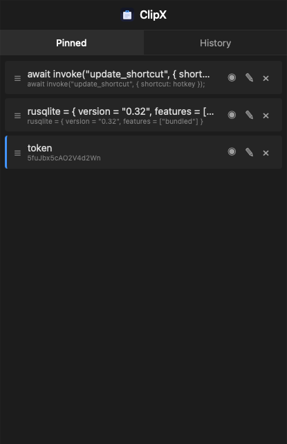
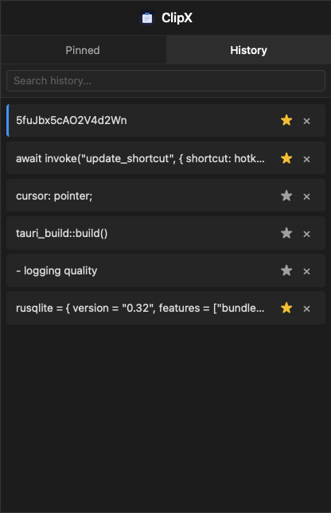

<p align="center">
  
  &nbsp;&nbsp;
  
</p>

A lightweight clipboard manager for desktop. It keeps track of text you copy so you can recall it later without redoing the work.

## What it does

- **Background presence** - Lives in your system tray / menu bar while you work.
- **Global hotkey** - Summon the history popup instantly with a keyboard shortcut (near your mouse cursor).
- **Quick dismiss** - Press Escape to hide the popup and get back to work.
- **Tray menu** - Open the app, change settings, or quit from the tray icon.
- **Configurable hotkey** - Choose your own keyboard shortcut to summon the popup.
- **Pin items** - Pin frequently used entries so they stay at the top, reorder them, and give each one a custom label.
- **Search history** - Filter clipboard history instantly with the search box.
- **Configurable history size** - Choose how many entries to keep (up to 50) in Settings.
- **Local only** - All clipboard history stays on your machine.

## Download

Pre-built installers for macOS, Windows, and Linux are available on the [Releases](../../releases) page.

> **macOS note:** If you see "clipboard-manager is damaged and can't be opened", run this in Terminal after installing:
> ```bash
> xattr -cr /Applications/clipboard-manager.app
> ```
> This removes the quarantine flag macOS adds to downloaded apps that aren't signed with an Apple Developer certificate.

## Creating a release

1. Update the version in `src-tauri/tauri.conf.json` and `src-tauri/Cargo.toml` if needed.
2. Commit the changes.
3. Tag the commit and push the tag:

```bash
git tag v0.1.1
git push origin v0.1.1
```

Pushing the tag triggers the GitHub Actions workflow, which builds installers for all platforms and publishes them as a new release.

## Running in development

```bash
pnpm tauri dev
```

This starts the app with live reload for both the frontend and the Rust backend.

## Building for production

```bash
pnpm tauri build
```

The compiled app will be available under `src-tauri/target/release/`.

## Tech stack

- Tauri v2
- React + Vite
- SQLite (local storage)

---

Built for keeping things simple and local.
