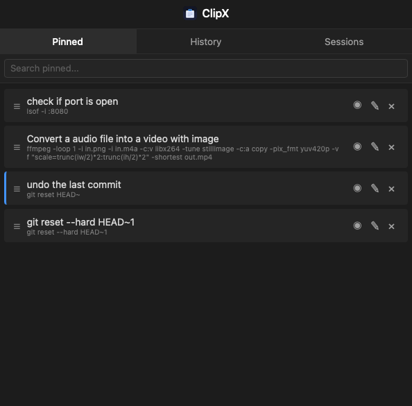
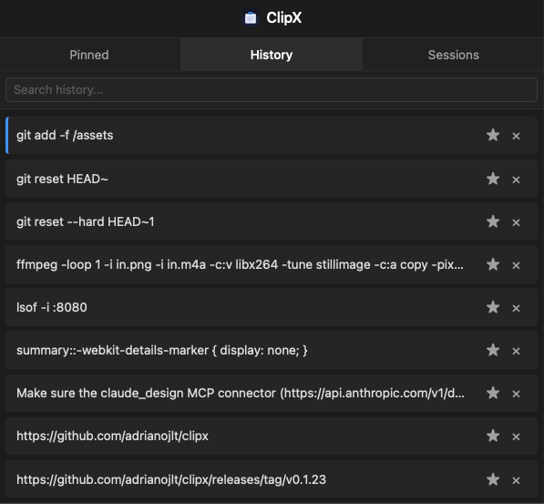
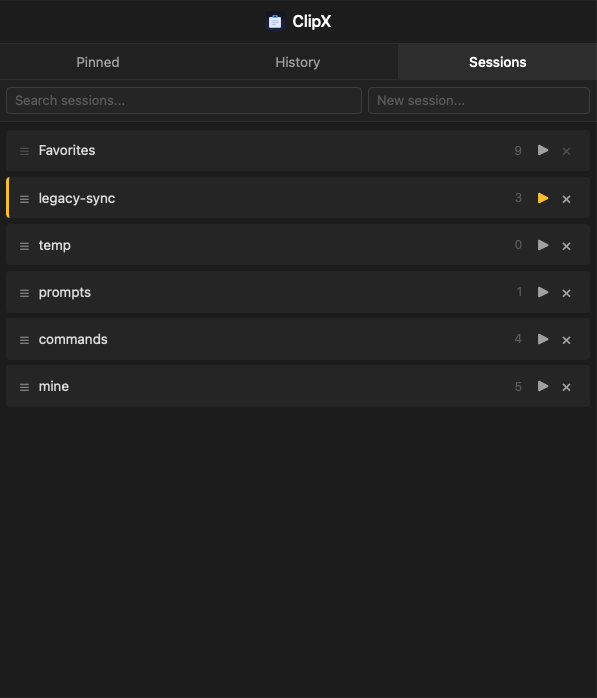

<p align="center">
  
</p>
<p align="center">
  
</p>

<p align="center">
  
</p>

A lightweight clipboard manager for desktop. It keeps track of text you copy so you can recall it later without redoing the work.

## What it does

- **Background presence** - Lives in your system tray / menu bar while you work.
- **Global hotkey** - Summon the history popup instantly with a keyboard shortcut (near your mouse cursor).
- **Quick dismiss** - Press Escape to hide the popup. When the search box is focused, the first Escape clears focus and a second Escape hides the popup.
- **Tray menu** - Open the app, change settings, or quit from the tray icon.
- **Configurable hotkey** - Record your own keyboard shortcut to summon the popup via Settings.
- **Pin items** - Pin frequently used entries so they stay at the top, reorder them, and give each one a custom label. Hide sensitive content with the eye toggle.
- **Sessions** - Group pinned items into named sessions and switch between them. The Pinned tab shows only the active session's items. The default "Favorites" session is permanent.
- **Search** - Filter both pinned items and clipboard history instantly with the search box. Press `Command+F` (configurable) to jump to the search box from anywhere in the popup.
- **Context menus** - Right-click a history or pinned item to pin it directly to a specific session.
- **Quick copy keys** - Press `1` through `9` to copy the Nth item in the current tab (or activate a session in the Sessions tab) without touching the mouse.
- **App switcher** - A separate global hotkey (default `Control+Option+Esc`, configurable in Settings) opens a list of currently open apps, each with its icon. Search by name, then press Enter or `1` through `9`, or click, to focus an app.
- **Hold to switch** - Keep the app switcher hotkey held down, move the mouse over a row, and release: that app is focused straight away. Release with the cursor anywhere else and the list simply stays open.
- **Most-used apps first** - The app list is ordered by frecency, so apps you switch to often and recently sit at the top and stay within reach of the `1` through `9` keys. Usage counts are stored locally alongside the rest of your data.
- **Cycle an app's windows** *(Windows only)* - Takes over `Alt+Esc` to step through the windows of the app you are already in, instead of every window on the desktop the way Windows does. Nothing is shown and focus is never taken: each press just moves to the next window. Turn it off in Settings to hand `Alt+Esc` back to Windows, or record a different shortcut for it.
- **Configurable history size** - Choose how many entries to keep (up to 50) in Settings.
- **Tab shortcuts** - Switch between Pinned, History, and Sessions tabs with configurable keyboard shortcuts (default Command+1 / Command+2 / Command+3).
- **Resizable window** - Adjust the popup width and height in Settings.
- **Update notifications** - Checks the GitHub Releases page for a newer version and shows a title-bar badge; check manually from Settings or the tray menu. No auto-download, no clipboard data sent.
- **Local only** - All clipboard history stays on your machine.

## Download

Pre-built installers for macOS, Windows, and Linux are available on the [Releases](../../releases) page.

> **macOS note:** If you see "ClipX is damaged and can't be opened", run this in Terminal after installing:
>
> ```bash
> xattr -cr /Applications/ClipX.app
> ```
>
> This removes the quarantine flag macOS adds to downloaded apps that aren't signed with an Apple Developer certificate.

## Testing

Run frontend unit tests:

```bash
pnpm test
```

Run tests in watch mode:

```bash
pnpm test:watch
```

Run Rust backend tests:

```bash
cd src-tauri && cargo test
```

## Code quality

Lint JavaScript and JSX:

```bash
pnpm lint
```

Format code with Prettier:

```bash
pnpm format
```

## Troubleshooting

If something goes wrong, check the log file for details.

**Log file location:**

- macOS: `~/Library/Application Support/com.adriano.clipx/logs/clipx.log`
- Windows: `%APPDATA%/ClipX/logs/clipx.log`
- Linux: `~/.config/ClipX/logs/clipx.log`

**What gets logged:**

- App startup and shutdown
- Database errors
- Clipboard monitor failures
- Settings load/save errors
- Shortcut registration failures

**What is NOT logged:**

- Clipboard content itself (privacy protection)
- Normal day-to-day operations

## Creating a release

See [RELEASING.md](./RELEASING.md) for the release checklist, including the mandatory step of publishing the draft release that the workflow creates.

## Running in development

```bash
pnpm tauri dev
```

This starts the app with live reload for both the frontend and the Rust backend.

## Building for production

```bash
pnpm tauri build
```

The compiled app will be available under `src-tauri/target/release/`.

## Tech stack

- Tauri v2
- React + Vite
- SQLite (local storage)

---

Built for keeping things simple and local.
